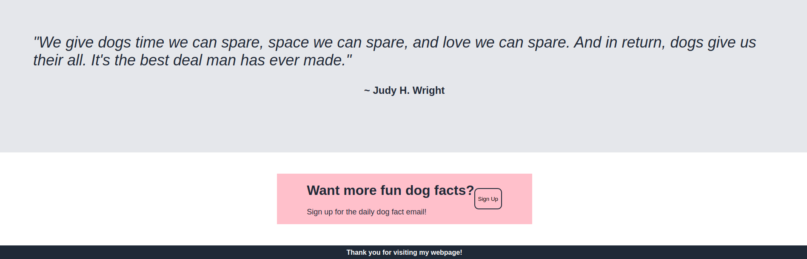

# landing-page

Objective:

Miniature Schnauzer Webpage:

I am creating a webpage to practice the skills I have learned using html and css. I chose the topic of Miniature Schnauzers because I have one and he is a wonderful dog. This is my first attempt at building a webpage from scratch and currently does not have active links or buttons. I wanted to create a layout that would be functional and easy to extend at a later time if I choose.

Webpage Images:

Credits:

I found the logo icon on iStock.

I found all dog images on pixabay.

